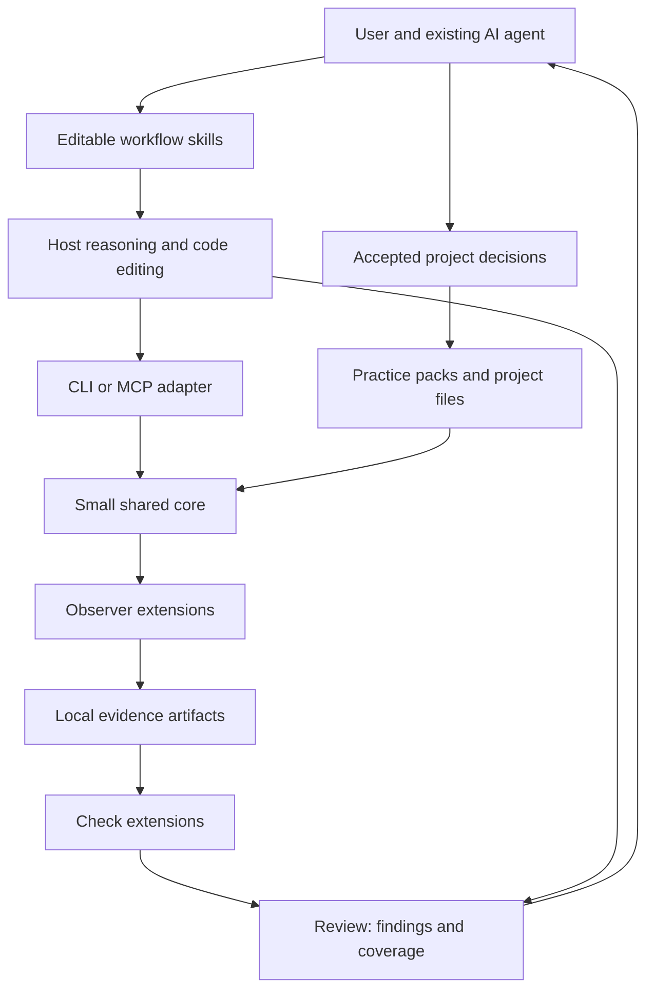

# AnyPixel Next — technical specification

**Proposed v0.1, 2026-10-08.** Every command and API in this document describes the new repository, not the installed AnyPixel beta. `anypixel-next` is an illustrative binary/package name pending availability checks. The manifest schema in this directory is executable specification; the runtime is unimplemented.

## Architecture



The host owns model choice, conversation, source edits, and external-tool authorization. The skill teaches the workflow. The core resolves context, validates artifacts, dispatches extensions, and renders results. It does not schedule an independent agent loop or run a second model behind the user's agent.

Use TypeScript, a maintained Node LTS, a small CLI parser, a maintained schema validator, the official MCP server SDK, and an optional Playwright/axe browser extension. At repository creation, pin tested versions in the lockfile and record them in the compatibility matrix. The current official MCP TypeScript SDK documents v2 and the 2026-07-28 protocol; host compatibility must be tested before committing to that line. Do not blindly echo a requested protocol version as the legacy server does. [Official SDK](https://github.com/modelcontextprotocol/typescript-sdk).

Use published libraries where they remove protocol, parsing, or browser maintenance. Dependency-free is not a goal. Browser binaries must not be downloaded merely to read context or validate a pack.

## Repository and module boundaries

```text
anypixel-next/
  src/
    core/            # context, artifacts, reviews, decisions; no browser or MCP imports
    cli/             # argument parsing and presentation
    mcp/             # transport and protocol adaptation only
    sdk/             # extension interfaces and fixture helpers
  extensions/web/    # optional workspace package; Playwright and axe
  packs/starter/     # normal data-only practice pack
  examples/          # custom pack, custom check, complete sample project
  schemas/           # versioned public artifact and manifest schemas
  tests/             # unit, extension contract, package, transport, end-to-end
  evals/             # briefs, permitted fixtures, rubrics, run manifests
  docs/              # quickstart, integration matrix, extension guide, decisions
  .github/           # CI and contributor templates
  LICENSE
  NOTICE
  CONTRIBUTING.md
  GOVERNANCE.md
  SECURITY.md
```

Publish one main package with the CLI, MCP entry point, starter files, and `./sdk` exports; one optional browser-extension package. Content packs remain directories first. Do not create a package for every internal module. No old marketing site, research output archive, screenshots, or generated PDFs in the new runtime package.

Import-direction tests prevent core from depending on adapters. First-party extensions register through the same public interface as third-party ones. Reports are built-in JSON/HTML serializers initially; a formatter plugin API waits for a real third-party use case.

## Project-owned files

```text
design/
  project.json         # configuration: selected packs, checks, extensions, scopes
  packs.lock.json      # resolved pack inventories and content hashes
  brief.md             # optional: task, audience, constraints, open questions
  system.md            # optional: pointers to existing components and tokens
  decisions/*.md       # accepted or proposed scoped decisions with frontmatter
  packs/               # optional project-local packs
.anypixel/
  contexts/<id>/       # immutable selected context and source inventory
  captures/<id>/       # immutable observation artifacts
  reviews/<id>/        # immutable review and export bundle
  tmp/                 # incomplete operations, never treated as published evidence
```

`init` creates only project.json and a suggested ignore entry for `.anypixel/`; it preserves existing files and prints the diff before any replacement would be needed. Brief and system files are optional, created when useful. Raw evidence is local and ignored by Git by default. Shareable review exports contain only explicitly selected artifacts; exports are not automatically uploaded.

Configuration is JSON, not executable JavaScript. It selects ordered local pack directories; locally installed extension modules; enabled check IDs and options; allowed source roots and capture origins; and an optional CI policy. Resolve all paths from the project root, not the installed package directory. A monorepo project root is explicit or the nearest ancestor containing `design/project.json`; stop at the workspace boundary. CLI `--project` and MCP `projectRoot` select the same root. Never scan sibling projects by default.

## Five shared operations

CLI and MCP call the same core functions. MCP tool names use underscores; no independent implementation or subprocess call to a command-line script. All requests use validated structured input; paths and arguments never become shell command strings.

| Core operation / MCP tool | CLI surface | Inputs and output | Writes |
| --- | --- | --- | --- |
| `context` / `design_context` | `context --task TEXT --scope PATH --json` | Task, scope, optional brief path → context ID, selected passages, provenance, conflicts, omissions | Context snapshot only |
| `observe` / `design_observe` | `observe --input request.json --json` | Observer ID, target, viewport, state label, requested artifact kinds → capture ID and artifact inventory | Capture only |
| `review` / `design_review` | `review --input request.json --json` | Context ID, capture IDs, check IDs/options, optional host assessments and base review ID → review ID, findings, coverage, export paths | New review only |
| `record` / `design_record` | `record --input decision.json --json` | Scoped decision text, reason, evidence references, status, acceptance attestation, optional superseded ID → decision path | Project decision file |
| `read` / `design_read` | `read ID --json` | Project-owned context/capture/review/decision ID; optional artifact path → bounded metadata/content or image | None |

Administrative CLI commands: `init`, `doctor`, `pack validate PATH`, `pack lock`, and `mcp`. These are not extra MCP tools. Extension installation uses the user's package manager; there is no MCP tool for installing or trusting executable packages. `doctor` reports versions, configured extension availability, host setup hints, and browser availability without installing anything.

`review` emits JSON and HTML into a new immutable review directory. CLI stdout is either the requested machine-readable result or concise human output; diagnostics go to stderr. MCP may also expose snapshots as resources, but the five-tool path must work for hosts that ignore resources. Native Skills-over-MCP support is optional, not required for v0.1.

Every operation result has `schemaVersion: 1`, an operation ID, and either a typed result or an error `{code, message, retryable, details}`. Error codes include `INVALID_INPUT`, `MISSING_DEPENDENCY`, `UNTRUSTED_EXTENSION`, `OUT_OF_SCOPE`, `CONFLICT`, `TIMEOUT`, `CANCELLED`, and `IO_ERROR`. Repeated mutating requests carry a caller-generated idempotency key; the same key and input hash return the completed result, while different input under the same key is a conflict. After a crash, incomplete work is restarted with a new operation ID, never presented as completed.

## Context resolution

The core is a context compiler, not an autonomous researcher. It returns relevant material and why it selected it. It never fetches arbitrary URLs in a pack during context assembly.

1. Validate configuration and locked packs. Enumerate only declared files; reject symlink escapes and path traversal.
2. Select passages using explicit scope and topic metadata, then deterministic text matching. No embeddings or model call is required.
3. Prefer current task instructions, explicit project guidance, and accepted in-scope decisions over general pack recommendations. This order applies to design guidance only; it cannot override the host's system instructions or tool permissions.
4. Include matching pack entry summaries and links; load full entries through `read` when needed. A starting budget of 12,000 UTF-8 bytes is a tunable product target, not a universal model-token claim. These links identify sources in the immutable context inventory, allowing `read` to fetch the snapshotted passage without reopening a mutable pack.
5. Include relevant decisions in stable ID order after scope filtering. If a governing project constraint cannot fit, return an explicit overflow requiring a narrower scope or larger budget. Do not silently drop it.
6. Return provenance for every passage: relative file path, line span, SHA-256, pack/version if applicable, and selection reason. Record omitted optional entries so the agent can request them.

Pack order is presentation order, not silent authority to overwrite conflicting prose. Duplicate pack or entry IDs fail validation. The core detects declared decision-key conflicts; it does not understand arbitrary prose contradictions. Potential semantic conflicts in guidance are surfaced by the host with their sources. Machine check options are overridden only by explicit project configuration and then explicit per-run options. The review records that effective configuration and each override.

Local edits to a locked pack cause a digest mismatch. `pack lock` deliberately updates the inventory; normal runs do not rewrite it. In a no-config skill-only workflow, the host can read Markdown directly, but it must not claim a locked runtime context was used.

## Practice packs

A pack is a directory with `pack.json`, guidance files, and optional standard Agent Skills directories. The [manifest schema](pack.schema.json) and [example](examples/dense-product-ui/pack.json) define the v1 data-only format. An entry has a namespaced ID, kind, relative path, topic labels, and optional scope selectors. A recommended check is an ID, not permission to download or execute code.

v0.1 accepts local directories, including directories inside packages the user has already installed. This deliberately avoids implementing a remote package manager. Users can share a Git repository, vendor a pack, or use their existing package manager and lockfile. `packs.lock.json` records source directory, pack version, and the path/hash inventory of manifest-declared files, including skill assets. Directory traversal is bounded; executable files and install hooks are excluded from data-only packs.

The core reports unsupported manifest major versions before using content. Pack versions use semantic versioning; a change to recommendations may affect outcomes even without a schema change, so reviews record exact hashes. Packs have no transitive `extends` resolution in v0.1. Compose them explicitly in the project configuration.

## Executable extensions

There are two extension points: **observers** produce artifacts, and **checks** interpret artifacts. Names are opaque namespaced strings such as `web/browser` and `brand/token-use`; core contains no design-domain enum. The shape below is a proposed SDK contract, not implemented SDK code.

```ts
type Extension = {
  apiVersion: 1;
  id: string;
  version: string;
  observers?: Record<string, Observer>;
  checks?: Record<string, Check>;
};
type Observer = {
  inputSchema: object; // JSON Schema, validated before invocation
  artifactKinds: string[];
  observe(input: unknown, io: ObserverIO): Promise<Observation>;
};
type Check = {
  optionsSchema: object;
  requires: string[]; // required artifact kinds, e.g. "axe/results"
  evaluate(input: CheckInput, io: CheckIO): Promise<CheckResult>;
};
// ObserverIO: AbortSignal, bounded artifact writer, structured logger.
// CheckIO: AbortSignal, read-only artifact reader, structured logger.
// CheckInput: capture manifest, validated options, resolved context ID.
// Observation, CheckResult and artifact envelopes follow the tables below.
```

An extension runs in a dedicated child process with timeouts and cancellation. This isolates failures; **it is not an OS security sandbox**. Native plugins can execute arbitrary code with the user's account permissions. Only explicitly configured, installed, trusted code runs. Capability descriptions explain behavior but do not enforce a security boundary. No prompt or downloaded pack can add itself to trusted executable configuration.

Each worker receives minimal environment variables and operation inputs; secret-bearing environment variables are excluded unless explicitly configured for that integration. The runtime validates outputs, referenced artifact IDs, and size limits. It labels plugin origin and version; it cannot prove that arbitrary third-party code measured honestly. Trust in that measurement is trust in the identified extension.

The browser observer collects screenshot, DOM-derived facts, and raw axe results in one browser session when requested. The axe check reads the stored `axe/results` artifact rather than opening a second browser. Live browser objects never cross the extension boundary. Other checks can consume those artifacts without browser dependencies. A native custom checker requires no changes to CLI/MCP schemas because its options are validated against its registered schema.

A small first-party `files/import` observer implements the same interface for explicitly supplied screenshots and documents. It records the supplied source description and marks the original collection session and revision as unknown unless independently supplied. Importing a screenshot never upgrades it to a verified live capture or creates DOM evidence.

## Evidence and review contracts

Public JSON Schemas for these envelopes must be implemented before extension API beta. Keep a schema as the wire-format source of truth and derive TypeScript types; do not maintain two competing definitions. The pack schema included here is the first concrete artifact. Browser-specific DOM payload details remain a first-spike deliverable and are an explicit API-beta gate in the roadmap.

| Artifact | Required fields and invariants |
| --- | --- |
| Context | `schemaVersion`, `id`, `task`, `scope`, `createdAt`, `sources`, `passages`, `conflicts`, `omitted`; source inventory includes digests and lock digest |
| Capture | `schemaVersion`, `id`, observer ID/version, target, state label, start/end times, viewport when relevant, source revision or `unknown`, dirty-source inventory when supplied, artifacts, limitations |
| Artifact reference | Stable ID, namespaced kind, relative path, MIME type, byte size, SHA-256, creation time; raw content lives in the capture bundle |
| Check result | Check ID/version, status, input artifact IDs, effective options, findings, limitations, duration, diagnostic error if execution failed |
| Finding | Stable ID within review, check or host author, category string, basis (`measured`, `inferred`, `human`), priority (`high`, `medium`, `low`), claim, goal relevance, evidence references, proposed action, uncertainty text |
| Review | `schemaVersion`, `id`, context ID, capture IDs, optional base review ID, tool/extension versions, effective policy, check results, host assessments, findings, coverage, timestamps, artifact manifest |
| Decision | ID, namespaced decision key, scope selectors, status, text, reason, source/evidence references, creation time, optional expiry and superseded ID; accepted status requires actor and acceptance source |

Check statuses: `completed`, `not_applicable`, `not_assessed`, `error`, or `cancelled`. `completed` says execution finished, not that the design passed. A completed check can produce findings or no findings. An incomplete axe result remains visibly unresolved within coverage. A failed process cannot report zero issues as a successful assessment.

Each evidence reference identifies a capture/artifact and optional region, selector, or source span. A measured finding requires at least one existing relevant artifact. A host-authored visual interpretation has basis `inferred` even if it references a screenshot. It records the host/model identifier when supplied; `unknown` is valid. Human judgments record the stated author, not a fabricated authenticated identity. Unsupported source-location guesses cannot be presented as verified edit locations.

Captures identify state and observation interval. Same-session collection reduces mismatch, but it is not an atomic snapshot of a changing page. Record navigation or instability; do not compare unmatched routes, states, or viewports as if they were equivalent. A hash proves artifact consistency after collection, not truth of a claim or reproducibility of model judgment.

Coverage lists configured checks and what each actually assessed. It also identifies requested visual or interaction work with no available assessor. The report has no composite design-quality score. Order findings by goal relevance and priority, preserving source attribution. Rendered text and embedded artifacts are escaped/sanitized; no plugin-supplied executable HTML enters an export.

### Optional CI policy

Interactive review reports findings without a global release verdict. A project may select check IDs, blocking priorities, and whether incomplete required checks fail CI. Model-inferred findings are advisory in v0.1; a human can turn a chosen decision into project policy later.

CLI exit codes: `0` operation completed and any requested CI policy passed; `1` completed evaluation failed the requested policy; `2` invalid input, infrastructure error, required assessment missing, or incomplete execution; `130` user cancellation. Optional check failures produce a partial report and exit `2` even in interactive mode, so automation cannot interpret the operation as fully successful. The report itself remains usable. JSON and MCP carry these distinctions as data rather than relying on process exit status.

## Decisions and memory

Decision frontmatter supplies the required fields above; Markdown contains the rationale and examples. Scope selectors are project-relative source globs and optional exact route labels. Omitted scope is the whole project and must be intentional. Decisions never travel between projects automatically.

The key names the choice being governed, for example `layout/invoice-comparison`. If two active accepted decisions with that key match the requested task scope, return a declared conflict. The owner can supersede one or make their scopes disjoint. Semantically contradictory entries under different keys require host or human judgment; the deterministic engine makes no semantic conflict-detection claim.

Lifecycle: `proposed` → `accepted` or `rejected`; `accepted` → `superseded` or `expired`. Expiry is computed from an ISO timestamp; no background job rewrites files. Supersession validates same-project IDs, identical keys and scopes, and prevents cycles. A narrower exception requires explicitly adjusting scopes rather than silently retiring a broader policy. Prior decisions stay readable in Git history and on disk. Rejected, expired, or superseded entries are excluded from active recommendations but remain available for explanation.

The `record` operation uses an exclusive project-write lock and atomic file replacement; it checks an expected content hash when updating an existing decision. Concurrent edits return `CONFLICT`, preserving both input and existing files. Direct Markdown edits are supported and validated next time context is loaded; malformed accepted decisions stop context generation with a fixable error, never silently disappear.

An acceptance source is a provenance attestation, such as a user instruction reference. The server cannot independently authenticate that a model accurately quoted a user. The host's permission and review system is the enforcement boundary. Do not market the record as a signed human approval.

## Failure and recovery

| Condition | Required behavior |
| --- | --- |
| Missing browser/extension | Name the missing dependency; continue only with explicitly available evidence; no silent browser install |
| Authenticated or stateful page | Use a user-supplied local storage-state file or host-captured import; never commit cookies; no automatic credential discovery |
| Capture timeout or unstable route | Preserve diagnostics in temporary storage; return failure or a labeled incomplete capture; never publish it as a complete observation |
| Missing input kind for a check | `not_assessed` with required kind; never a zero-finding success |
| Plugin exception | Other independent checks can finish; save partial report; return operational failure |
| Disk full or interrupted write | Temporary directory plus atomic publish; no manifest points to unfinished artifacts |
| Tampered or missing evidence | `read`/`review` refuses verification; identify bad artifact and recapture or explicitly import as unverified |
| Conflicting accepted decisions | Return both sources and `CONFLICT`; narrow scope or resolve before giving prescriptive guidance |
| Cancellation | Abort workers, close owned browser contexts, mark unfinished checks cancelled; keep already completed immutable captures |
| Old artifact major version | Read with an explicit supported decoder or return unsupported; never reinterpret silently |

Use UUID operation IDs; never identify an input merely by a mutable `latest` pointer. Concurrent read-only work can proceed; decision writes and publication use exclusive creation/locks. Default per-observer timeout is 60 seconds, per-check timeout 30 seconds, configurable per project. Bound file sizes and total capture size in configuration with documented defaults established by the browser spike. Browser actions during observation are read/inspect only; interactive login, submissions, and source fixes remain host actions under existing authorization.

Capture and source inputs may contain hostile page instructions. Treat them as data, never pack instructions or tool-installation authority. Built-in path readers enforce allowed roots. Browser targets require configured origins, including redirects; loading a website may contact its subresources, so a capture is not an offline operation. The runtime adds no telemetry or model-provider egress by default. Existing host and website data flows remain visible integration dependencies.

## Compatibility and budgets

API and artifact versions evolve independently from pack versions. Before 1.0, breaking changes require release notes, version bumps, and migration fixtures. Never auto-rewrite user guidance. Lockfile updates are explicit; old review artifacts remain read-only. No promise of compatibility with old AnyPixel contract schema 2.

Proposed budgets: context generation under 500 ms p95 on the documented fixture/hardware; no browser download during main-package install; at most five default MCP tools; default inline tool output under 12 KB, with larger evidence fetched by ID. These are acceptance targets to measure, not current performance claims. Record cold versus warm startup and browser download separately. A budget miss should first reduce scope or improve lazy loading, not invent another service.
